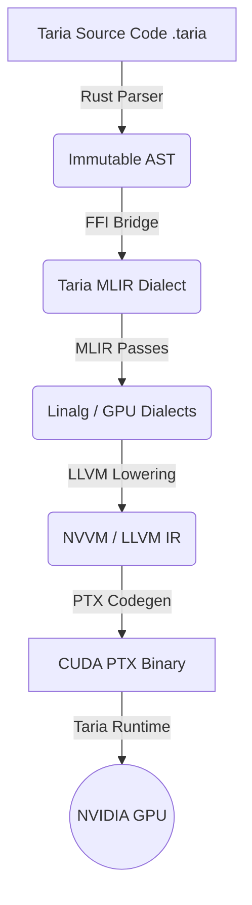

<div align="center">

# 🪐 Taria
**The GPU-Native Compiler for Semantic Compression & Latent Tensor Computation**

[](https://opensource.org/licenses/Apache-2.0)
[](#)
[](https://llvm.org/)
[](https://mlir.llvm.org/)
[](https://www.rust-lang.org/)
[](https://developer.nvidia.com/cuda-toolkit)

**[Documentation](docs/) • [Architecture](docs/ARCHITECTURE.md) • [Contributing](docs/CONTRIBUTING.md) • [Roadmap](docs/roadmap.md)**

</div>

---

Taria is a next-generation, high-performance Domain-Specific Language (DSL) and compiler infrastructure built from the ground up for **extreme-scale semantic tensor compression**. By mapping a Python-like syntax down to raw NVPTX execution via MLIR, Taria brings neural latent-space encoding and AI-driven data reduction directly to the GPU substrate.

## 🔭 Vision

Modern AI requires moving terabytes of tensor data across interconnects, creating catastrophic memory bandwidth bottlenecks. Traditional compression algorithms (LZ4, Zstd) fail on high-entropy floating-point data, while existing ML frameworks (PyTorch, XLA) treat neural compression models as black-box graphs rather than first-class compiler optimizations.

**Taria treats semantic compression as a language primitive.**

By fusing autoencoder pipelines, vector quantization, and entropy coding into an MLIR-backed compiler pass, Taria aims to achieve staggering compression ratios (e.g., **1TB → 1GB**) at native GPU memory bandwidth speeds. It is the infrastructure designed for a future where latent-space computation is the default.

---

## ✨ Features

- **Pythonic Ergonomics, Native Speed**: Write expressive, type-safe DSL code that compiles AOT (Ahead-of-Time) to aggressively optimized GPU binaries.
- **First-Class GPU Semantics**: `@gpu.kernel` decorators with explicit tiling, block sizes, and shared memory allocations.
- **MLIR Infrastructure**: Custom `taria` dialect for high-level semantic optimizations before lowering to `linalg` and `gpu` dialects.
- **Zero-Cost Abstractions**: Rust-powered frontend ensures memory-safe AST construction with zero runtime overhead in the final CUDA binary.
- **Semantic Compression Primitives**: Built-in compiler support for autoencoders, learned representations, and quantization schemas.
- **Asynchronous Execution**: Native CUDA stream scheduling, memory pooling, and automatic kernel fusion.

---

## 🏗 Architecture

Taria leverages a multi-stage hybrid compiler stack designed for modularity and absolute performance.



| Layer                       | Technology    | Responsibility |
| --------------------------- | ------------- | -------------- |
| **Frontend**                | Rust          | Zero-copy lexing, Pratt parsing, AST, Semantic Analysis |
| **FFI Bridge**              | C ABI         | Panic-safe ownership transfer of AST to C++ backend |
| **Intermediate Rep.**       | C++ / MLIR    | Optimization, kernel fusion, auto-tiling, dialect conversion |
| **Backend**                 | C++ / LLVM    | NVVM lowering, register allocation, PTX code generation |
| **Runtime**                 | CUDA / C++    | Async stream execution, pinned memory pooling |

---

## 💻 Example: Semantic Chunk Compression

Taria's syntax is heavily inspired by Python but statically typed for tensor shapes and memory layouts.

```python
# compress_pipeline.taria

from taria.models import NeuralEncoder
from taria.quant import VectorQuantizer

# The compiler automatically fuses these operations into a single PTX kernel
@gpu.kernel(block_size=256, shared_mem="32kb")
def compress_chunk(chunk: Tensor[f32, 1024, 1024]) -> Tensor[i8, 32, 32]:
    # 1. Semantic dimensionality reduction via neural autoencoder
    latent = NeuralEncoder.encode(chunk)

    # 2. Map latent vectors to discrete codebook (Vector Quantization)
    quantized = VectorQuantizer.apply(latent)

    return quantized
```

---

## 📂 Repository Structure

The monorepo is governed by a hybrid `Cargo` and `CMake` build system.

```text
taria/
├── frontend/      # Rust: Lexer, recursive-descent parser, AST
├── ffi/           # Rust: Extern "C" bindings, opaque AST handles
├── dialects/      # C++ : MLIR Taria dialect (TariaOps.td)
├── passes/        # C++ : MLIR lowering & optimization passes
├── backend/       # C++ : LLVM/NVVM code generation and compilation
├── runtime/       # CUDA: Async stream execution, memory pools
├── include/       # C/C++ public headers (taria_bridge.h)
├── tools/tariac/  # Rust: The command-line compiler frontend
├── docs/          # Architecture, compiler engineering guides
└── tests/         # E2E compilation, lit tests, and Rust unit tests
```

---

## ⚙️ Build Instructions

### Prerequisites
- **Rust Toolchain**: 1.70+ (`cargo`, `rustc`)
- **CMake**: 3.20+
- **C++ Compiler**: GCC 11+ or Clang 14+ (C++20 support required)
- **CUDA Toolkit**: 12.0+
- **LLVM & MLIR**: Built from source (LLVM 17+) with NVPTX backend enabled.

### 1. Build the Rust Frontend
```bash
cargo build --release --workspace
# Runs tests for the frontend parser and FFI bridge
cargo test --workspace
```

### 2. Configure and Build the C++/CUDA Backend
*Note: Ensure `LLVM_DIR` and `MLIR_DIR` are pointing to your LLVM installation.*

```bash
mkdir build && cd build
cmake .. \
    -DCMAKE_BUILD_TYPE=Release \
    -DLLVM_DIR=/path/to/llvm/lib/cmake/llvm \
    -DMLIR_DIR=/path/to/llvm/lib/cmake/mlir \
    -DCMAKE_CUDA_ARCHITECTURES=80;90 # Target Ampere/Hopper
make -j$(nproc)
```

---

## 🔬 The Compiler Pipeline

1. **Lexing & Parsing (Rust)**: The source file is scanned using a SIMD-aware, zero-copy lexer. The recursive descent / Pratt parser builds an immutable, arena-allocated AST.
2. **FFI Hand-off**: The AST is wrapped in an opaque C handle and safely transferred to the C++ MLIR context.
3. **MLIR Transformation (C++)**:
   - **AST to Taria Dialect**: The syntax tree is mapped to high-level operations (`taria.encode`, `taria.quantize`).
   - **Taria to Linalg/GPU**: Operations are decomposed into standard MLIR linear algebra blocks and GPU launch domains.
4. **LLVM Codegen**: The Standard GPU dialect is lowered to NVVM, heavily optimized by LLVM passes, and finally emitted as a CUDA PTX binary.
5. **Execution**: The lightweight CUDA runtime schedules the PTX binaries onto async streams utilizing zero-copy pinned memory.

### Example MLIR Lowering
The snippet from earlier is initially represented in the MLIR `taria` dialect:

```mlir
taria.gpu_kernel @compress_chunk(%chunk: tensor<1024x1024xf32>) -> tensor<32x32xi8> {
  %latent = taria.encode %chunk : tensor<1024x1024xf32> -> tensor<32x32xf32>
  %quant = taria.quantize %latent : tensor<32x32xf32> -> tensor<32x32xi8>
  taria.return %quant : tensor<32x32xi8>
}
```

---

## ⚡ Performance Philosophy

To hit extreme compression throughputs at native hardware speeds, Taria is engineered around:
- **Warp Divergence Elimination**: Language restrictions ensure divergent branching within latent modeling is minimized.
- **Memory Coalescing**: Taria’s semantic types enforce strictly aligned, contiguous memory access patterns optimized for HBM3 bandwidth.
- **Speculative Kernel Fusion**: By keeping compression ops in the `taria` MLIR dialect as long as possible, the compiler fuses encoding and quantization into single-launch kernels, drastically reducing SRAM/VRAM round-trips.

---

## 🗺️ Roadmap

Taria is actively evolving. Our roadmap to `v1.0` includes:

- [ ] **AMD ROCm / Vulkan Backends**: Expanding beyond NVIDIA hardware.
- [ ] **JIT Compilation Runtime**: Dynamic compilation for varying tensor shapes (similar to PyTorch Inductor).
- [ ] **Distributed GPU Execution**: Native syntax for tensor sharding across NCCL rings.
- [ ] **AI-Guided Auto-Tuning**: Neural cost models to predict optimal block sizes and memory layouts during MLIR lowering.
- [ ] **TPU Support**: Emitting XLA HLO for Google TPU deployment.

---

## 🤝 Contribution Guide

We welcome compiler engineers, ML researchers, and systems programmers.
- **Code Style**: Rust code must pass `cargo fmt` and `cargo clippy`. C++ code follows the [LLVM Coding Standards](https://llvm.org/docs/CodingStandards.html).
- **Testing**: All MLIR passes must be accompanied by `FileCheck` tests. Rust modules require rigorous unit tests.
- **Workflow**: Please open an Issue or an RFC in the `docs/rfcs/` folder before submitting major architectural PRs.

See [CONTRIBUTING.md](docs/CONTRIBUTING.md) for detailed environment setup and architectural guidelines.

---

## 🛡️ Security & Reliability

- **Frontend Safety**: Built in 100% safe Rust, eliminating buffer overflows and memory leaks during parsing and AST generation.
- **FFI Stability**: C-ABI boundaries utilize `catch_unwind` and strict ownership models to prevent cross-language undefined behavior.
- **Deterministic Builds**: Compiler outputs are guaranteed deterministic given identical target flags and source ASTs.

---

## 📜 License

Taria is licensed under the [Apache License, Version 2.0](LICENSE) with LLVM Exceptions, matching the standard open-source compiler ecosystem.

---

> *"The bandwidth of the future is not found in wider buses, but in deeper representations."*
> — **The Taria Compiler Team**
